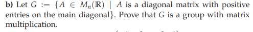

We have $A, B \in G$

$AB$ is diagnonal because both $A$ and $B$ are diagonal
Also, entries on main diagnonal of $AB$ are positive (because they are product of entries on main diagonal)

$\Rightarrow AB \in G$
$\Rightarrow "*"$ is a binary operation in $G$

$"*"$ is associative (matrix multiplication)

Natural element is $I$ (identity), $I \in G$

$\forall A \in G$

$$
A =
\begin{bmatrix}
    \lambda1 & .. & .. &  0 \\
    0 & \lambda2 & .. & 0 \\
    0 & 0 & \lambda3 & .. \\
    0 & .. & .. & \lambda n
\end{bmatrix}
$$

$\lambda j > 0$ $\forall j = 1,..,n$

$$
A^-1 =
\begin{bmatrix}
    \frac{1}{\lambda1} & .. & .. &  0 \\
    0 & \frac{1}{\lambda2} & .. & 0 \\
    0 & 0 & \frac{1}{\lambda3} & .. \\
    0 & .. & .. & \frac{1}{\lambda n}
\end{bmatrix}
\in G
$$

since $\frac{1}{\lambda j} > 0$ $\forall j = 1,..,n$

$\Rightarrow A^-1 A = I$

$\Rightarrow (G; *)$ is a group 